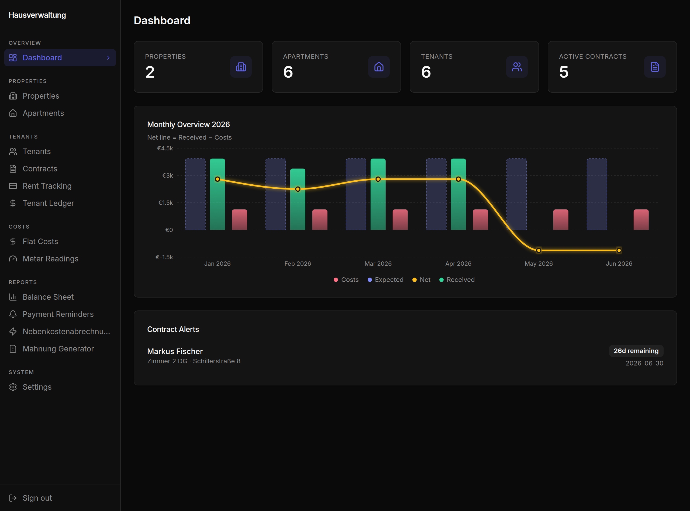
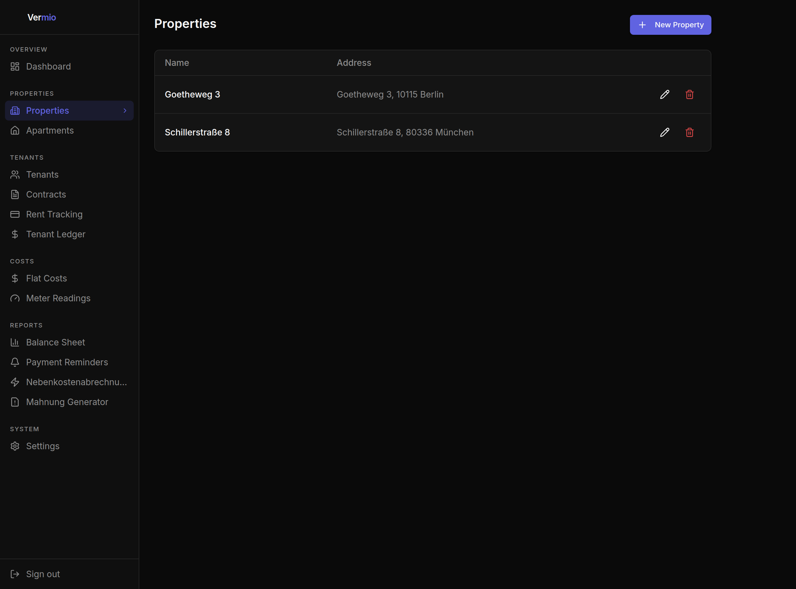
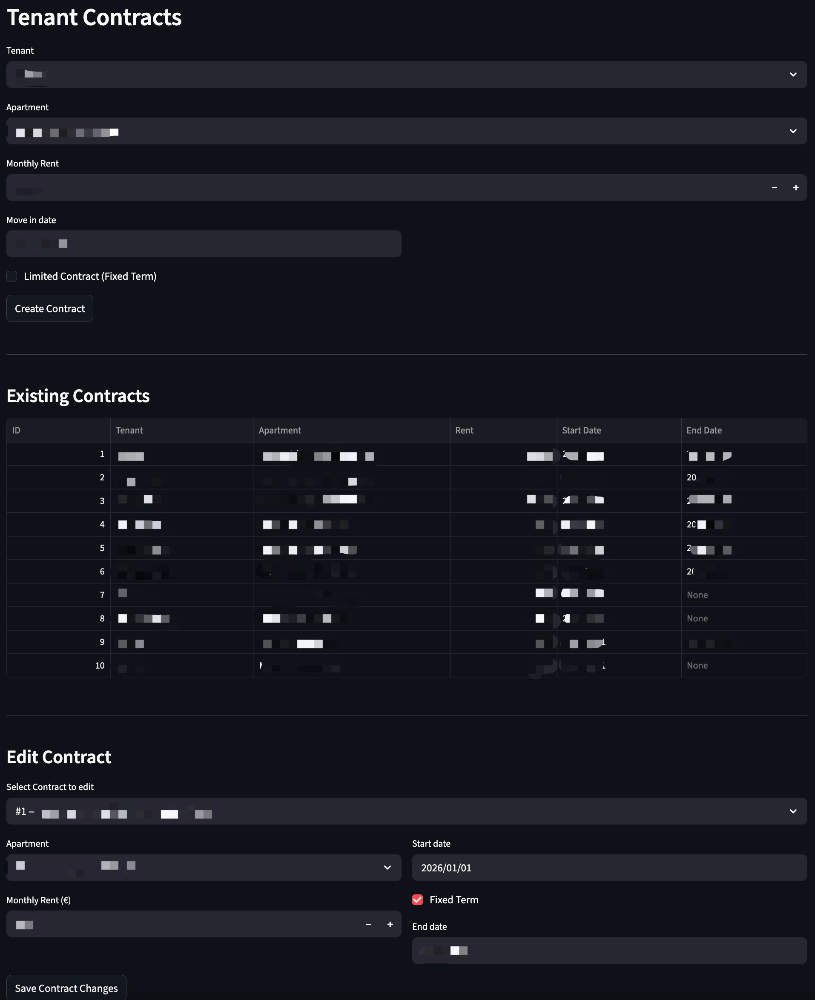
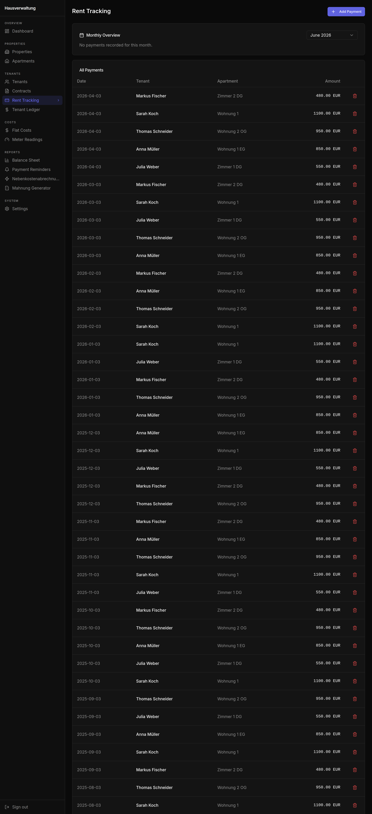
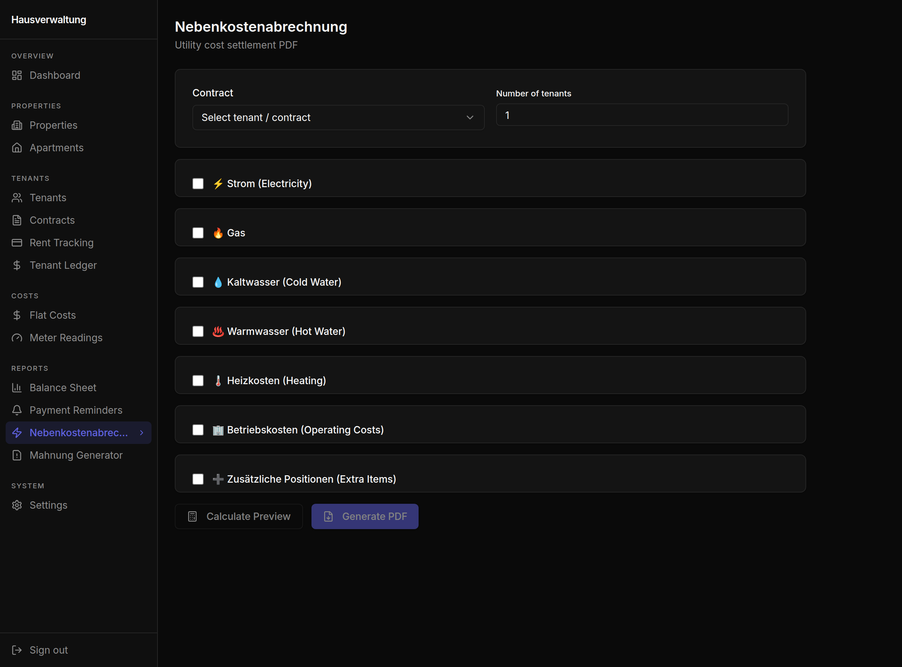
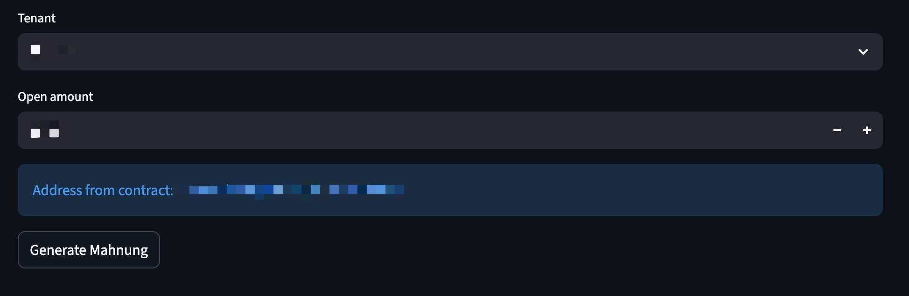

# Landlord Management System (Hausverwaltung)

A web-based property management application tailored for landlords in Germany. Built with Python and Streamlit, it covers the full rental lifecycle — from managing properties and tenants to generating legally-relevant documents like Nebenkostenabrechnungen and Mahnungen.

---

## Screenshots

| Dashboard | Properties |
|---|---|
|  |  |

| Contracts | Rent Tracking |
|---|---|
|  |  |

| Nebenkostenabrechnung | Mahnung Generator |
|---|---|
|  |  |

---

## Features

### Dashboard
- At-a-glance metrics: total properties and tenants
- Automatic alerts for contracts expiring within the next 90 days
- Highlights already-expired contracts in red

### Properties
- Add properties with name and address
- View all properties in a table
- Delete properties by ID

### Apartments
- Link apartments to a specific property
- Support for individual units and shared flat rooms (WG-Zimmer)
- **Flat grouping**: assign rooms to a named flat (e.g. "Wohnung 1") to group WG rooms together
- Edit existing apartments: room name and flat label
- View and delete existing apartments

### Tenants
- Register tenants with name, email, and gender
- Edit tenant information: name, email, gender, and assigned apartment
- View tenants alongside their assigned apartment (via contract)
- Delete tenants from the system

### Contracts
- Create rental contracts linking a tenant to an apartment
- Set monthly rent amount
- Support for open-ended and fixed-term (befristet) contracts
- Overlap detection: warns if the apartment is already occupied in the selected period
- Edit existing contracts: apartment, rent, start/end dates
- Terminate a contract with a move-out date (preserves history)
- Delete contracts
- Full move-out / move-in flow: terminate old contract, create new one for incoming tenant

### Rent Tracking
- Record individual rent payments against a contract
- Specify payment amount and date
- Supports partial and custom payment amounts
- Monthly overview: view all payments across all properties and tenants for a selected month

### Tenant Ledger
- View full payment history for any tenant
- Displays amount and date for each recorded payment

### Nebenkostenabrechnung (Utility Billing)
- Tenant selected from dropdown (auto-fills address from contract)
- **Auto-detects number of persons** sharing the same flat via the flat grouping (can be overridden manually)
- Calculate electricity costs (Strom) per tenant based on:
  - Total flat cost, number of tenants, billing period, monthly prepayment
- Calculate Betriebskosten per tenant based on:
  - Total operating costs, number of tenants, billing period, monthly prepayment
- Automatically computes Nachzahlung (additional payment due)
- Generates a polished A4 letter-style PDF with:
  - Recipient address block and landlord name
  - Gender-aware salutation (Sehr geehrter Herr / Sehr geehrte Frau)
  - Itemized calculation tables with step-by-step breakdown
  - Color-coded total (red = Nachzahlung, green = Guthaben)
  - Landlord signature image
  - 7-day payment deadline for Nachzahlungen

### Mahnung Generator (Payment Reminder)
- Generate a formal payment reminder PDF for a tenant
- Gender-aware salutation
- Highlighted outstanding amount
- Landlord signature embedded
- Ready to print or send digitally

---

## Tech Stack

| Layer       | Technology         |
|-------------|--------------------|
| UI          | Streamlit          |
| Database    | SQLite3            |
| PDF Engine  | ReportLab          |
| Language    | Python 3.10+       |

---

## Project Structure

```
landlord_system/
├── app.py              # Main Streamlit app — UI layout and page routing
├── db.py               # Database initialization, CRUD helpers (insert, fetch, delete, execute)
├── logic.py            # Business logic: cost calculations (Strom, BK), tenant ledger
├── pdfgen.py           # PDF generation: Nebenkostenabrechnung and Mahnung
├── requirements.txt    # Python dependencies
├── data/
│   └── landlord.db     # SQLite database (auto-created on first run, git-ignored)
└── pdf/                # Output directory for generated PDFs (git-ignored)
```

---

## Database Schema

| Table        | Key Fields                                              |
|--------------|---------------------------------------------------------|
| `properties` | id, name, address                                       |
| `apartments` | id, property_id, name, flat                             |
| `tenants`    | id, name, email, gender                                 |
| `contracts`  | id, tenant_id, apartment_id, rent, start_date, end_date |
| `payments`   | id, contract_id, amount, payment_date                   |

---

## Getting Started

### Prerequisites
- Python 3.10 or higher
- pip

### Installation

```bash
# 1. Clone the repository
git clone <repo-url>
cd landlord_system

# 2. Create and activate a virtual environment
python3 -m venv venv
source venv/bin/activate        # macOS/Linux
# venv\Scripts\activate         # Windows

# 3. Install dependencies
pip install -r requirements.txt

# 4. Run the application
streamlit run app.py
```

The app will be available at `http://localhost:8501`.

---

## Usage Guide

### Typical Workflow

1. **Add a Property** → Properties menu
2. **Add Apartments** to the property → Apartments menu
3. **Register Tenants** (with gender) → Tenants menu
4. **Create a Contract** linking tenant ↔ apartment with rent and dates → Contracts menu
5. **Record monthly Rent Payments** → Rent Tracking menu
6. **Review payment history** per tenant → Tenant Ledger menu
7. **Generate Nebenkostenabrechnung** at end of billing period → Nebenkostenabrechnung menu
8. **Send a Mahnung** if a tenant has outstanding payments → Mahnung Generator menu

### Move-out / Move-in Flow

1. Go to **Contracts** → Terminate Contract → set move-out date
2. Create a new contract for the incoming tenant on the same apartment
3. The system warns if the dates overlap with an existing active contract

### Nebenkostenabrechnung Calculation Logic

**Electricity (Strom):**
```
cost_per_tenant     = total_flat_cost / number_of_tenants
daily_limit         = (monthly_limit × 12) / 365 / tenants
period_limit        = daily_limit × billing_days
Nachzahlung (Strom) = cost_per_tenant − period_limit
```

**Betriebskosten:**
```
cost_per_tenant  = total_bk_cost / number_of_tenants
period_cost      = (cost_per_tenant / total_months) × billed_months
period_limit     = (monthly_limit / tenants) × billed_months
Nachzahlung (BK) = period_cost − period_limit
```

**Total due = Nachzahlung Strom + Nachzahlung BK**

---

## Generated Documents

All PDFs are saved to the `pdf/` directory and can be downloaded directly from the Streamlit UI.

| Document                  | Filename pattern              |
|---------------------------|-------------------------------|
| Nebenkostenabrechnung     | `pdf/Abrechnung_<Tenant>.pdf` |
| Mahnung (Payment Reminder)| `pdf/Mahnung_<Tenant>.pdf`    |

---

## License

MIT
